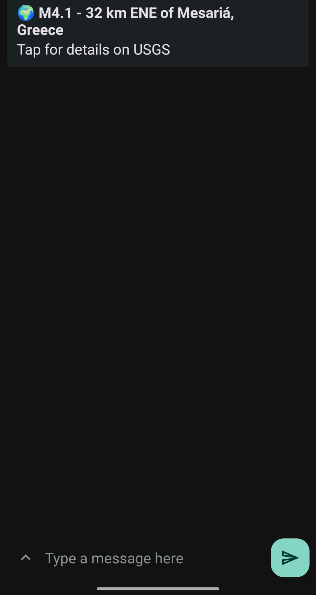
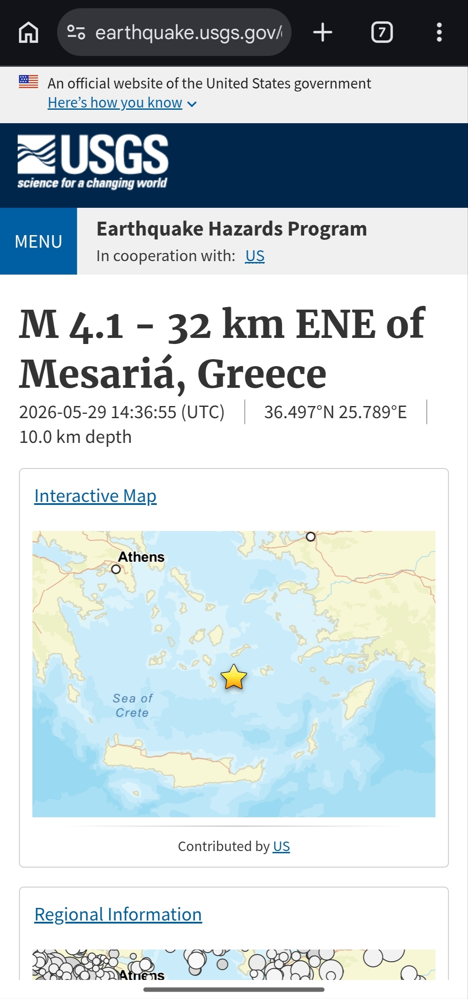

# 🌍 Nightwatch — Ειδοποιήσεις Σεισμών για την Ελλάδα

[🇬🇧 English](README.md) · **🇬🇷 Ελληνικά**

[](https://github.com/F0rgiv3n/nightwatch/actions/workflows/monitor.yml)
[](https://www.python.org/)
[](LICENSE)

Το **Nightwatch** παρακολουθεί τους σεισμούς στην Ελλάδα και στέλνει ειδοποίηση
στο κινητό σου μέσα σε λίγα λεπτά από τη στιγμή που θα γίνει ένας — **δωρεάν**,
**πλήρως αυτοματοποιημένα**, χρησιμοποιώντας μόνο **επίσημα, δημόσια δεδομένα**.

Τρέχει μόνο του 24/7 πάνω σε **GitHub Actions** (χωρίς server, χωρίς κάρτα),
διαβάζει δεδομένα σεισμών από το δημόσιο API της **U.S. Geological Survey
(USGS)**, και στέλνει τις ειδοποιήσεις μέσω **[ntfy](https://ntfy.sh)**. Όλο το
πρόγραμμα είναι ένα ευανάγνωστο αρχείο Python.

---

## 📲 Demo

Μια πραγματική ειδοποίηση που έφτασε σε κινητό. Με ένα tap ανοίγει η επίσημη
σελίδα του σεισμού στο USGS (χάρτης, μέγεθος, βάθος, συντεταγμένες):

<p align="center">
  
  &nbsp;&nbsp;
  
</p>

---

## Γιατί φτιάχτηκε

Η Ελλάδα είναι από τις πιο σεισμογενείς χώρες της Ευρώπης — μικροί και μέτριοι
σεισμοί γίνονται σχεδόν καθημερινά. Ήθελα έναν **απλό, αξιόπιστο και δωρεάν**
τρόπο να ειδοποιούμαι αμέσως στο κινητό όποτε γίνεται ένας αξιοσημείωτος σεισμός
στη χώρα, χωρίς:

- να εγκαταστήσω άλλη μια εφαρμογή γεμάτη διαφημίσεις,
- να πληρώνω για server που θα κρατάει ζωντανό ένα script, ή
- να κάνω scraping σε σελίδες που δεν επιτρέπεται.

Το Nightwatch λύνει ακριβώς αυτό. Παράλληλα, είναι μια συμπαγής επίδειξη ενός
ολοκληρωμένου pipeline: **άντληση δεδομένων → εντοπισμός του νέου → ειδοποίηση →
αποθήκευση κατάστασης → εκτέλεση με χρονοπρογραμματισμό.**

## Τι κάνει

- ⏱️ Ελέγχει για πρόσφατους σεισμούς στην Ελλάδα **κάθε 15 λεπτά**.
- 🗺️ Φιλτράρει με **γεωγραφικό «κουτί»** γύρω από την Ελλάδα (ηπειρωτική χώρα,
  Αιγαίο, νησιά) μέσω του query API της USGS — όχι ένα παγκόσμιο feed με άσχετα
  αποτελέσματα.
- 🎚️ Ειδοποιεί μόνο πάνω από **μέγεθος που ορίζεις εσύ** (προεπιλογή M3.5), ώστε
  να μη χτυπάει το κινητό για κάθε μικροδόνηση.
- 🔁 Θυμάται τι έχει ήδη αναφέρει, οπότε κάθε σεισμό τον λαμβάνεις **μία φορά**.
- 🤫 Στην πρώτη εκτέλεση μένει σιωπηλό (αποθηκεύει «baseline»), για να μη σε
  πλημμυρίσει με ειδοποιήσεις στο ξεκίνημα.
- 🔔 Στέλνει μια καθαρή ειδοποίηση που οδηγεί κατευθείαν στην επίσημη σελίδα USGS.

## Πώς δουλεύει

```
                 ┌──────────────────────────────────────────────┐
   GitHub Actions│  κάθε 15 λεπτά  →  python nightwatch.py       │
   (το "cron")   └───────────────────────┬──────────────────────┘
                                         │
                 ┌───────────────────────▼──────────────────────┐
                 │ 1. Ρώτα το USGS για πρόσφατους σεισμούς μέσα  │
                 │    στο κουτί της Ελλάδας, πάνω από το μέγεθος │
                 │ 2. Σύγκρινε με το seen.json (όσα ήδη έστειλα) │
                 │ 3. Για κάθε ΝΕΟ σεισμό → στείλε ntfy push     │
                 │ 4. Αποθήκευσε το ενημερωμένο seen.json        │
                 └───────────────────────┬──────────────────────┘
                                         │
                          ntfy.sh ───────▼──────►  📱 το κινητό σου
```

Η κατάσταση (`seen.json`) διατηρείται ανάμεσα στις προγραμματισμένες εκτελέσεις
μέσω του **cache του GitHub Actions** — έτσι το bot θυμάται τι έχει ήδη στείλει,
χωρίς να «λερώνει» το ιστορικό του git με αυτόματα commits.

## Τεχνολογίες & τι δείχνει (για portfolio)

Είναι σκόπιμα μικρό, αλλά αγγίζει μια πλήρη, ρεαλιστική αλυσίδα εργαλείων:

| Τομέας | Τι δείχνει |
| --- | --- |
| **Ενσωμάτωση δημόσιου API** | Κατανάλωση του REST API `fdsnws` της USGS, parsing GeoJSON |
| **Γεωχωρικό φιλτράρισμα** | Ερώτημα με bounding box (lat/lon) για μια περιοχή |
| **Εντοπισμός αλλαγών** | Λογική «τι είναι νέο από την προηγούμενη φορά» με κατάσταση |
| **Push notifications** | Ειδοποιήσεις βασισμένες σε συμβάντα, μέσω ntfy |
| **Containerization** | Ένα μικρό, single-stage **Dockerfile** |
| **CI/CD & αυτοματισμός** | Προγραμματισμένο **GitHub Actions** workflow που τρέχει 24/7 |
| **Διαχείριση secrets** | Ο στόχος ειδοποίησης ως GitHub Actions **secret**, ποτέ hard-coded |
| **Stateful workflows** | Διατήρηση του `seen.json` ανάμεσα στις εκτελέσεις μέσω **cache** |
| **Καθαρός κώδικας** | Ένα ευανάγνωστο αρχείο, απλές συναρτήσεις, χωρίς over-engineering |

## Πώς να το τρέξεις

### Τοπικά

```bash
pip install -r requirements.txt

export NTFY_TOPIC=to-diko-sou-monadiko-topic     # διάλεξε όποιο μοναδικό όνομα θες
python nightwatch.py
```

Κάνε Subscribe στο ίδιο topic μέσα από την εφαρμογή [ntfy](https://ntfy.sh) (ή
άνοιξε `https://ntfy.sh/to-diko-sou-monadiko-topic` στον browser) για να
λαμβάνεις τις ειδοποιήσεις.

### Με Docker

```bash
docker build -t nightwatch .
docker run -e NTFY_TOPIC=to-diko-sou-monadiko-topic nightwatch
```

### 24/7 με GitHub Actions (δωρεάν)

1. Κάνε fork/clone το repo στον δικό σου λογαριασμό GitHub.
2. Πρόσθεσε ένα **secret** με όνομα `NTFY_TOPIC`
   (Settings → Secrets and variables → Actions) με την τιμή του topic σου.
3. Τέλος — το workflow στο [`.github/workflows/monitor.yml`](.github/workflows/monitor.yml)
   τρέχει κάθε 15 λεπτά. Μπορείς επίσης να το τρέξεις χειροκίνητα από το tab
   **Actions** («Run workflow»).

> Η πρώτη προγραμματισμένη εκτέλεση καταγράφει ένα σιωπηλό baseline· οι
> ειδοποιήσεις ξεκινούν από τον επόμενο νέο σεισμό.

## Παραμετροποίηση

Όλα βρίσκονται στο [`config.yaml`](config.yaml):

```yaml
interval: 300   # δευτερόλεπτα ανάμεσα στους ελέγχους (όταν τρέχει ως συνεχής διεργασία)

sources:
  - name: greece-earthquakes
    type: usgs
    min_magnitude: 3.5      # ειδοποίηση μόνο για μέγεθος 3.5 και πάνω
    period_days: 1          # κοίτα πόσες μέρες πίσω σε κάθε έλεγχο

    # Bounding box γύρω από την Ελλάδα (latitude / longitude):
    min_latitude: 34.0
    max_latitude: 42.0
    min_longitude: 19.0
    max_longitude: 29.5
```

| Ρύθμιση | Σημασία |
| --- | --- |
| `min_magnitude` | Αγνόησε σεισμούς μικρότερους από αυτό |
| `period_days` | Πόσες μέρες πίσω να κοιτάει σε κάθε έλεγχο |
| `min/max_latitude`, `min/max_longitude` | Το «κουτί» (περιοχή) προς παρακολούθηση |
| `interval` | Δευτερόλεπτα ανάμεσα στους ελέγχους (μόνο στον συνεχή βρόχο, όχι στο Actions) |

**Άλλη περιοχή;** Άλλαξε απλώς το bounding box.
**Πολλές ειδοποιήσεις;** Ανέβασε το `min_magnitude` (η Ελλάδα έχει έντονη
σεισμικότητα).

## Δομή του project

```
nightwatch/
├── nightwatch.py              # όλο το πρόγραμμα (fetch → detect → notify)
├── config.yaml                # τι παρακολουθεί
├── requirements.txt           # requests, PyYAML
├── Dockerfile                 # εκτέλεση σε container
├── .github/workflows/
│   └── monitor.yml            # προγραμματισμένος 24/7 runner (GitHub Actions)
├── docs/                      # screenshots για το demo
└── README.md
```

## Επεκτασιμότητα

Το Nightwatch είναι δομημένο ώστε να μπαίνουν εύκολα κι άλλες πηγές δεδομένων.
Κάθε πηγή είναι μια συνάρτηση που επιστρέφει λίστα από `{"id", "title", "url"}`·
την καταχωρείς στο dictionary `SOURCES` μέσα στο `nightwatch.py` και αναφέρεις
τον `type` της στο `config.yaml`. Φυσικές επόμενες προσθήκες: τα ελληνικά
σεισμικά feeds **ΝΟΑ (Γεωδυναμικό Ινστιτούτο Αθηνών) / EMSC**, ειδοποιήσεις
καιρού, ή οτιδήποτε έχει δημόσιο API.

## Σημειώσεις & περιορισμοί

- **Πηγή δεδομένων:** Η USGS είναι παγκόσμιος φορέας και καταγράφει αξιόπιστα τους
  ελληνικούς σεισμούς περίπου από M3+. Για πολύ μικρούς τοπικούς σεισμούς, το
  ελληνικό εθνικό δίκτυο (ΝΟΑ) ή το EMSC θα ήταν πιο εξαντλητικά — καλή μελλοντική
  πηγή.
- **Χρόνος:** Τα προγραμματισμένα workflows του GitHub μπορεί να καθυστερήσουν
  λίγα λεπτά υπό φόρτο, οπότε δες τις ειδοποιήσεις ως «μέσα σε ~15–20 λεπτά», όχι
  ως σύστημα έγκαιρης προειδοποίησης πραγματικού χρόνου.
- **Ειδοποιήσεις:** Τα ntfy topics στον δημόσιο server είναι αναγνώσιμα από
  όποιον ξέρει το όνομα — διάλεξε ένα που δεν μαντεύεται εύκολα.

## Άδεια

[MIT](LICENSE) — ελεύθερο για χρήση, τροποποίηση και μάθηση.
